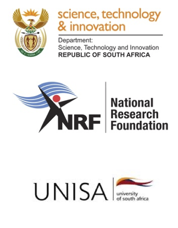

```@meta
CurrentModule = ePowerSim
```

# ePowerSim

Documentation for [ePowerSim](https://github.com/DSI-NRF-PENO/ePowerSim.jl).

ePowerSim.jl is a Julia package for modeling,  simulation and analysis of electric power system. The package is designed to present a uniform data interface for static, quasi-static, dynamic analysis, as well as network operation optimisation. The design phylosophy of ePowerSim is premised  on  Unix systems design phylosophy, which entails creation of small functions that can be used in functional compositions. It  provides a co-simulation framework for further development and  experimentation of various type of models of electric power systems components or abstract entities that have mathematical formalism or data representation. ePowerSim.jl makes extensive use of cutting edge packages such as DifferentialEquations.jl, Dataframes.jl, NamedTupleTools.jl, Helics.jl,  ForwardDiff.jl, JuMP.jl and BifurcationKit just to mention a few in Julia ecosystem.

!!! warning "ePowerSim Under Active Development"
    **The ePowerSim library for electric system components is under heavy development, nevertheless they can be extended by users.**

## Setup Guide

This package requires Julia >= v1.11.4 

To install it, please run:

`] add https://github.com/DSI-NRF-PENO/ePowerSim.jl.git`


!!! note "Installation of ePowerSim"
    **It is highly suggested that ePoweSim is installed in a new environment.**
	

## Getting Started

- **ePowerSim Modeling Concepts** - Presents the fundamental concepts behind ePowerSim modeling.

- **Components** - Describe electric power system components models.
  
- **Static Modeling and Simulation** - Explains  how to use ePowerSim in static modeling, simulations and analyses such as poweflow, distributed power flow, optimal power flow, continuation power flow.
  
- **Dynamic Modeling and Simulation** -Describes how to use ePowerSim to formulate a dynamic model of an electric power system, and subsequently use the packate for simulation and analyses such small-signal stability, system pertubations and co-simulations.
    
	
## Funding
Development of this project is in part funded by the *South African
Department of Science and Innovation (DSI), and National Research
Foundation (NRF) under  South African Research Chair Initiative
(SARChi) in Power, Energy, Network and Optimnisation  (Grant Numbers 150572, 2023-2027).

```@raw html
   
```

